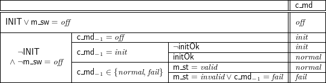

# logic-function-tables
Linux / OSX: 
[](https://travis-ci.org/unitb/logic-function-tables)


Verification of function table specifications

## TODO
 1. ~~Adaptive cell height based on contents~~
 2. ~~Add bold, italics and strikethrough~~
 3. ~~Make UnitB.FunctionTable the one-stop module for all the eDSL~~
 4. ~~improve the parsing of expressions when arrays are provided: \array{r{}@l}~~
 5. Add a command to automatically insert the verification results in the document
 6. add support for quasi quoters in literate code
 7. prove invariants
 8. Add support for held-for
 9. Color table cells based on verification results


## Example
The following table:





is specified by the following Haskell code (in README.hs):

```haskell
do enumSort "Status" [("sOff","off"),("sOn","on")]
   enumSort' "Mode"   ["off","normal","init","fail"]
   enumSort' "Validity" ["valid","invalid"]
   constant "INIT" "\\Bool"
   controlled "md" "Mode"
   monitored "sw" "Status"
   constant "initOk" "\\Bool"
   monitored "st" "Validity"
   table                                               (raw "\\cMd") $ do
     cellH 2 (raw "\\INIT \\lor \\mSw = \\sOff")       (raw "\\off") 
     branch (conjList 
         [ (raw "\\neg \\INIT")
         , (raw "\\neg \\mSw = \\sOff") ]) $ do
       cell (raw "\\preCMd = \\off")                   (raw "\\init")
       branch (raw "\\preCMd = \\init") $ do
         cell (raw "\\neg \\initOk")                   (raw "\\init")
         cell (raw "\\initOk")                         (raw "\\normal")
       branch (raw "\\preCMd \\in \\{\\normal,\\fail\\} ") $ do
         cell (raw "\\mSt = \\valid")                  (raw "\\normal")
         cell (raw "\\mSt = \\invalid \\lor \\preCMd = \\fail")             
                                                       (raw "\\fail") 
```

The verification results can be obtained by replacing
`renderSpecMDFile "README.md"` with `verifySpec`. The above table
produces the following results:

_verification results not available_

We inserted a disjointness problem on purpose and Z3 found it
easily.

To regenerate README.md, simply use:

```
./README.hs 
```
